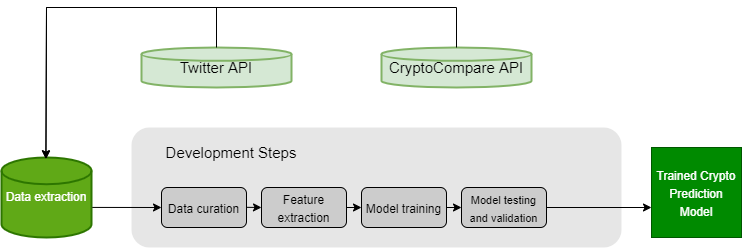
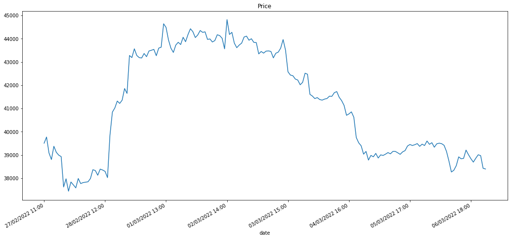

# Can public sentiment improve cryptocurrency price forecasting? With a particular interest: FOMO in buying cryptocurrency

> The University of Manchester, School of Computer Science
> A thesis submitted in fulfilment of the requirements for the degree of BSc (Hons) Computer Science w/ Business and Management

## Abstract

This project aims to build a neural network architecture and two machine learning models to predict future cryptocurrency prices and identify to what extent sentiment improves the accuracy of the models. The recurrent neural network selected for this project is a long short-term memory. The machine learning algorithms are Random Forest and Support Vector Machine, which will perform a regression task. The models are trained on three distinct datasets to evaluate the prediction accuracy. The datasets consist of historical Bitcoin price independently, Bitcoin price in conjunction with the compound value of sentiment, and Bitcoin price in combination with engagement score. This thesis proposes a novel dataset that weighs people’s sentiment based on engagement metrics extracted from Twitter. The dataset aims to enhance the performance of the forecasting models that predict Bitcoin prices. Furthermore, the project is interested in identifying to what extent unskilled investors are driven by Fear of missing out on buying cryptocurrency assets. Fear of missing out on investment is reflected by an emotional reaction from the fear of potentially losing profitable scenarios. Past research shows that various individuals benefit from unanticipated gains, and an expansion of up to 90% of amateur investors losing millions of dollars in speculative investments is identified (Barber et al., 2008). The paper investigates a potential correlation between Dogecoin price fluctuations, trading volumes, and the Twitter mass sentiment when Elon Musk tweets about this digital asset.

## Disclaimer

In mid-April 2022, Elon Musk threatened to and then bought Twitter (Hirsch et al., 2022). His Twitter audience grew by roughly 2.5 million users (2.4 per cent) in less than two days of the event (SocialTracker, 2022). Most of this paper was written before this event.

## Aims and Objectives

The aim of the thesis is to build a neural network to predict future cryptocurrency prices and identify to what extent sentiment improves the model’s accuracy. The artificial Recurrent Neural Network (RNN) selected for this project is a long short-term memory model. The network is trained on multiple data collections to analyse and compare the effect of Twitter sentiment on the model’s performance. For sentiment extraction, the objective is to quantify the rate of positiveness or negativeness for a piece of text sourced from Twitter. The script uses Twitter API to scrape filtered posts on a specific word, hashtag or token (i.e. #BTC, bitcoin). The code extracts the sentiment after a process of tokenisation and ‘text cleaning’. Afterwards, the sentiment value shows a decimal between [-1,1], meaning [negative, positive], where zero is neutral. The sentiment related to each Twitter text piece is averaged per hour since the LSTM model uses historical cryptocurrency prices reported hourly. During the LSTM model’s optimisation stage, the objective is to increase the accuracy of the model by measuring the following performance metrics: training and validation loss, Mean square error (MSE), Mean absolute error (MAE), Root-mean-square error (RMSE), Mean Absolute Percentage Error (MAPE) and Pearson’s correlation coefficient (PCC) (including time lag). 

The ideal scenario would be to set the hyperparameters as to achieve:
1. The lowest MSE, MAE, RMSE, MAPE.
2. The lowest training and validation loss.
3. The highest Pearson’s correlation coefficient (PCC). The project attempts to calculate the highest PCC based on a lag. If the lag is different from zero, it shifts the predicted price to align with the actual price and maximise the PCC value.

## Achievements

In this project, I have successfully implemented one state-of-the-art long short-term memory ar- chitecture (Shen and Shafiq, 2020) and two machine learning models, Random Forest and Support Vector regression. Additionally, I trained the models effectively using several datasets and presented a score-based data collection constructed of people’s sentiment and engagement indicators derived from Twitter. This new dataset enhanced the performance of the state-of-the-art neural network architecture that predicts Bitcoin prices. 
Another major accomplishment was establishing a possible association between the engagement score, market price changes and trading volumes in response to public statements made by influential figures. The crypto market’s movements were compared to public sentiment in order to determine whether independent traders are engaging in cryptocurrency investments out of fear of losing out on potentially profitable opportunities.

## Project pipeline

## Dataset

The project uses Twitter and CryptoCompare APIs and the forecasting models use datasets containing historical prices and sentiment scores from 27-02-2022, 11.00 AM to 07-03-2022, 00.00 AM.
Following figure depicts the fluctuations in the Bitcoin price over the specified time
period.

## Score-based dataset (using engagement metrics)

The engagement rate is calculated by examining the number of followers, likes, and impressions received by a social media post. This article proposes a score-based dataset that weighs each post’s sentiment according to its level of engagement.

The following two metrics count towards the score-based dataset:
- retweet count (or tweetr ) - The number of times the tweet has been retweeted.
- followers count (or tweetf ) - The number of followers the tweet’s author has.

Since there are Twitter users with no followers or posts with no engagement, we add 1 to each metric before normalisation to avoid division by zero. Next, we extract the sentiment value ($s$) generated using VADER. However, since VADER might return 0 for neutral tweets\footnote{VADER returns values between -1 and 1, negative and positive emotion, respectively}, we want to avoid a final score of zero. Because a neutral post is always better than no post, we assign to a neutral sentiment a minimum value s = 1e^{-3}.

## Experiments

LSTM trained on historical prices and engagement score dataset.

.png)

RF trained on historical prices and engagement score dataset.

%20-%20grid.png)

SVR trained on historical prices and engagement score dataset.

%20-%20grid.png)

## Analysing Fear of missing out

Scenario 1:
In the first scenario, Elon Musk tweeted on January 14th at 6.18 AM (UTC) that “Tesla merch
buyable with Dogecoin” (Musk, 2022b). In other words, Tesla would accept customers that are
willing to pay for mini models of electric cars, Tesla’s “Giga Texas” belt buckle or the firm’s t-shirt (not electric vehicles, only goods) with the meme-based cryptocurrency. Musk’s Twitter announcement came late compared to the rumours already circulating on social media.

.png)

.png)

.png)

Scenario 2:
In the second scenario, Elon’s non-informative tweet ”I will eat a happy meal on television if
@McDonalds accepts Dogecoin” (Musk, 2022a) immediately resulted in a 3.38 per cent (or 75.11
million USD) price increase. The DOGE price escalation had a prolonged effect, resulting in pinnacle of 7.88 per cent that lasted for 31 hours. This market movement might have been influenced by McDonald’s officials as well. The fast food company challenged Elon Musk with a similarly non-informative tweet, "only if @tesla accepts grimacecoin".

.png

## Results

The report identifies that the machine learning models outperform the recurrent neural network architecture in the cryptocurrency price prediction task. Especially the Random Forest (RF) model trained on BTC historical price in conjunction with engagement score showed a Pearson’s correlation coefficient of 0.9967 between actual values and forecasted values. Regarding the particular interest of the research of identifying a potential correlation between the emotion-focused reaction of investors and Dogecoin price movements, the report showed a scenario in which the novel dataset was able to reflect a possible PCC of 0.9868 within a 3 hours interval. The novel dataset that incorporates the engagement metrics alongside the compound value of the sentiment showed good performance in both objectives of the report in training models and reflected a possible relation between Fear of missing out and DOGE price fluctuations

## References:
1. Barber, B. M., Lee, Y.-T., Liu, Y.-J. and Odean, T. (2008), ‘Just how much do individual investors lose by trading?’, Review of Financial Studies 22(2), 609–632
2. Hirsch, L., Isaac, M. and Conger, K. (2022), ‘Twitter nears a deal to sell itself to elon musk’. URL: https://www.nytimes.com/2022/04/24/technology/twitter-board-elon-musk.html
3. SocialTracker (2022), ‘Elon musk twitter stats and analytics (@elonmusk)’. URL: https://www.socialtracker.io/twitter/elonmusk/
